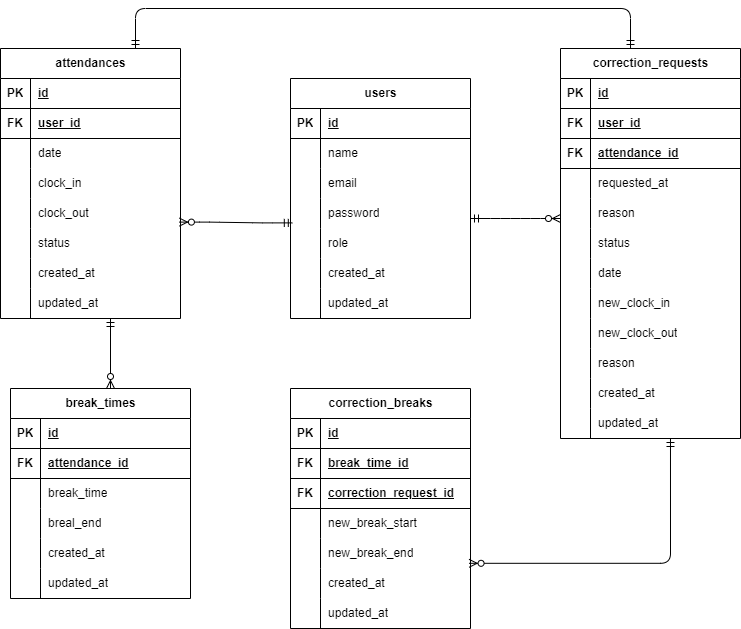

# 環境構築

1. Dockerを起動する
2. プロジェクト直下で下記コマンドを実行する

```
make init
```

## メール認証
mailtrapというツールを使用しています。<br>
以下のリンクから会員登録をしてください。　<br>
https://mailtrap.io/

メールボックスのIntegrationsから 「laravel 7.x and 8.x」を選択し、　<br>
.envファイルのMAIL_MAILERからMAIL_ENCRYPTIONまでの項目をコピー＆ペーストしてください。　<br>
MAIL_FROM_ADDRESSは任意のメールアドレスを入力してください。　

## ER図


## PHPUnitを利用したテストに関して
以下のコマンド:  
```
docker-compose exec php bash
php artisan migrate:fresh --env=testing
./vendor/bin/phpunit
```
